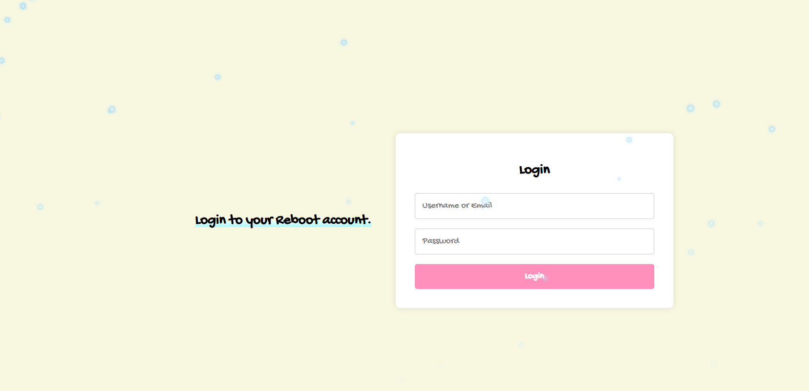
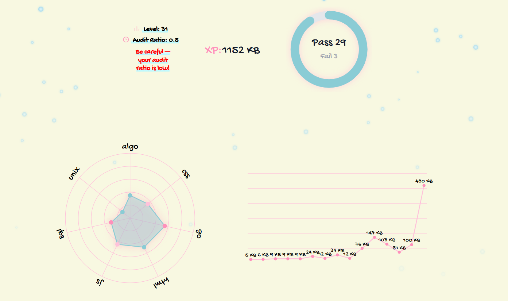

# GraphQL Personal Profile Platform

A Vue.js web app that displays a personalized user profile in reboot01 institute powered by a secure **GraphQL API** with **JWT authentication** and **interactive SVG statistics** for educational data.

## Features

- **JWT Authentication** for secure access
- **SVG-based interactive statistics**
- **GraphQL API** for structured, flexible querying
- **Dynamic Vue Components**
- **Elegant, Responsive Design**

## Tech Stack

| Frontend | Auth   | Visualization | API       |
|----------|--------|----------------|-----------|
| Vue.js   | JWT    | SVG            | GraphQL   |

## Setup Instructions

### 1. Clone the Repository

```bash
git clone https://github.com/yourusername/vue-graphql-profile.git
cd my-vue-app
```

### 2. Setup Frontend

```bash
npm install
npm run dev
```

> or just visit (https://graphql-learn-reboot01.vercel.app)

## Screenshots

> Include: Login Page, Profile Page, SVG Stats Panel

### Login Page


### Home Overview


## Author

**Malak Ahmed**  
Full-stack developer & cybersecurity enthusiast 
(https://github.com/NADRA03)
